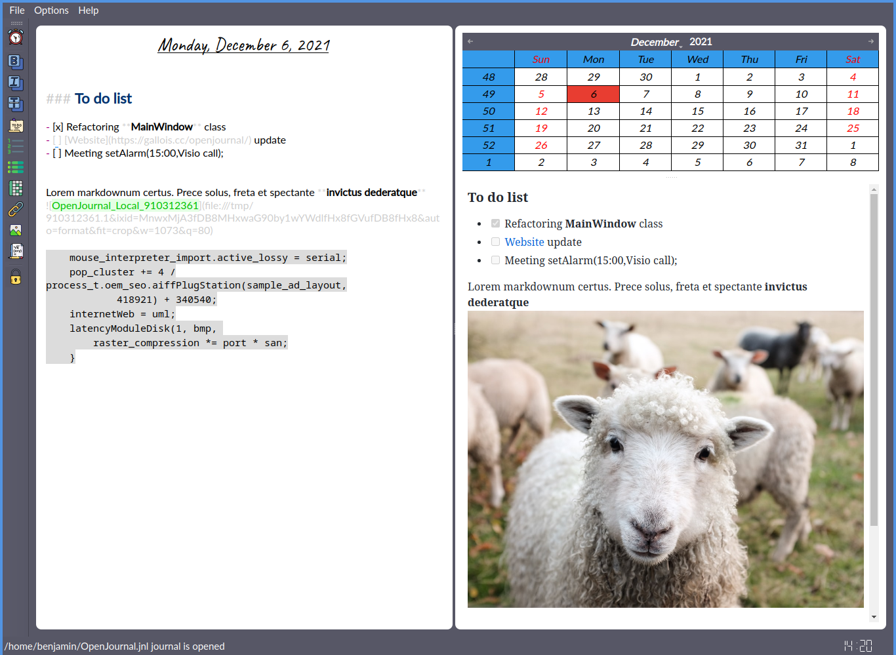

# OpenJournal

    

# OpenJournal

**OpenJournal** is a simple yet powerful journal, note-taking, and personal assistant application with full [Markdown](https://daringfireball.net/projects/markdown/) support. It provides live rendering, alarms, and productivity features to help you write, organize, and remember important tasks.

📖 Full documentation: [openjournal.readthedocs.io](https://openjournal.readthedocs.io/en/latest/)

---

## Who is it for?

* ✍️ **Writers**
  Journaling is a powerful tool for creative growth. Writers can store plot outlines, observations, character notes, dialogue snippets, and more.

* 📓 **Anyone**
  Keeping a daily diary helps organize thoughts, celebrate achievements, reflect on experiences, and relieve stress by writing down feelings and situations.

* 💼 **Professionals**
  Track tasks, estimate time, set reminders, and never miss a meeting. Built-in alarms keep you on schedule and boost productivity.

---

## Technology

OpenJournal uses a database-backed system to store your journals:

* **Local storage**:
  Journals can be stored in a single [SQLite](https://www.sqlite.org/index.html) file for easy backup and portability between computers.

* **Remote storage**:
  With [MariaDB](https://mariadb.org/), you can set up a database server for remote access. This allows syncing journals across devices and adding password protection for extra security.

---

## Features

✔️ Alarms & reminders  
✔️ Live Markdown rendering & highlighting  
✔️ LaTeX rendering  
✔️ Built-in privacy mode & journal lock  
✔️ PDF export  
✔️ System tray integration  
✔️ Local & remote database support (SQLite & MariaDB)  
✔️ Secure journals with password protection  
✔️ Keyword search (`Ctrl+F`)  
✔️ Multi-language support  
✔️ Insert local images  
✔️ Drag & Drop support (images, text files)  
✔️ Smart Markdown cursor handling  
✔️ Inline LaTeX expressions  
✔️ Inline calculator (Qalculator integration)  

---

## Screenshot

---

## Installation

OpenJournal provides prebuilt binaries for:

* **Linux**
* **Windows** (installer & portable version)
* **macOS**

👉 See the [installation guide](https://openjournal.readthedocs.io/en/latest/) for detailed instructions.
